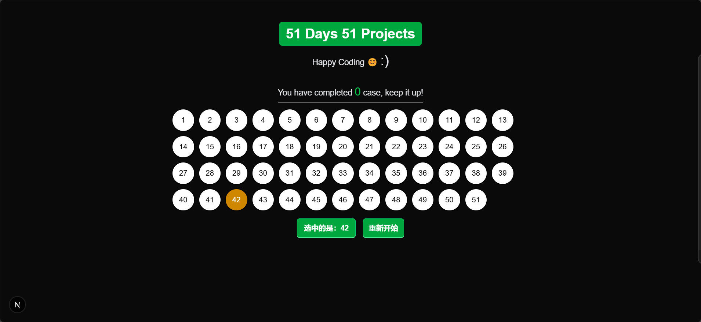
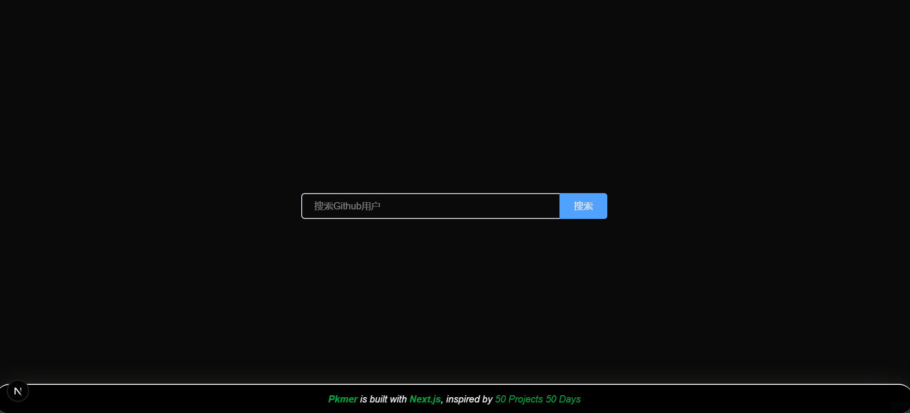
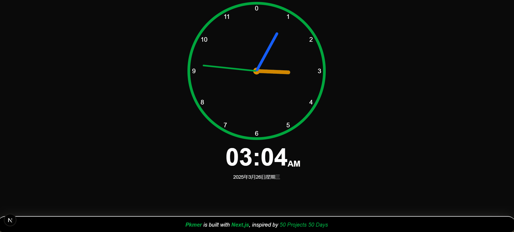
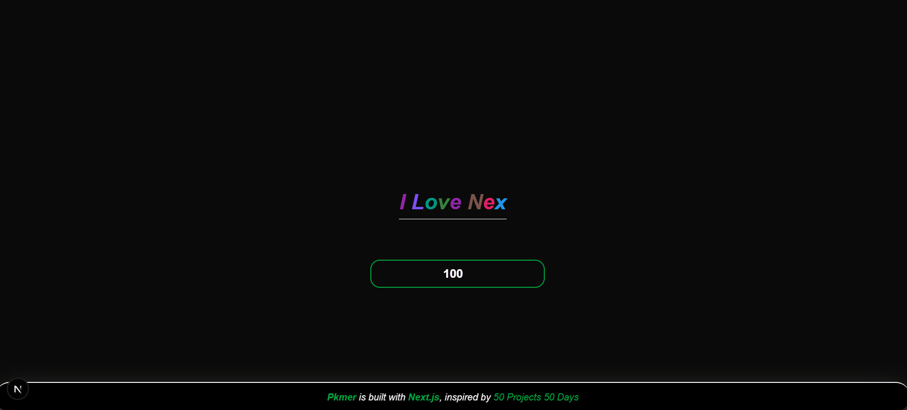
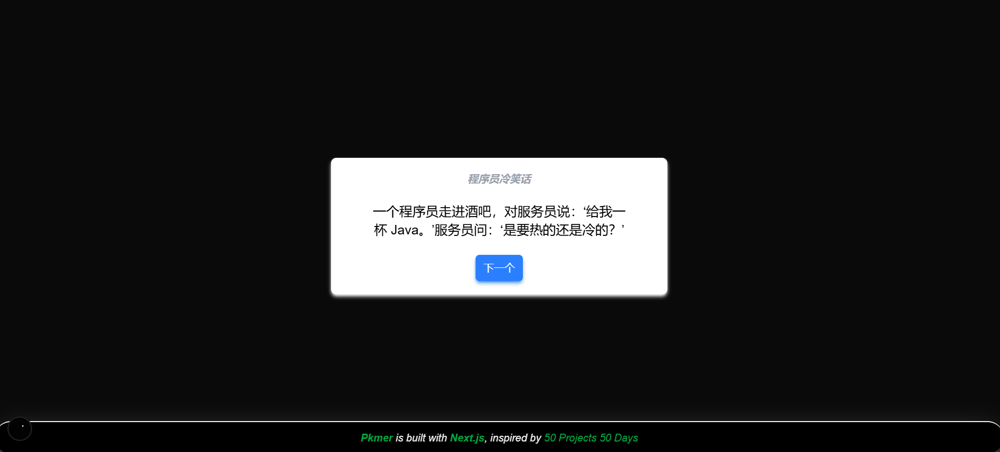
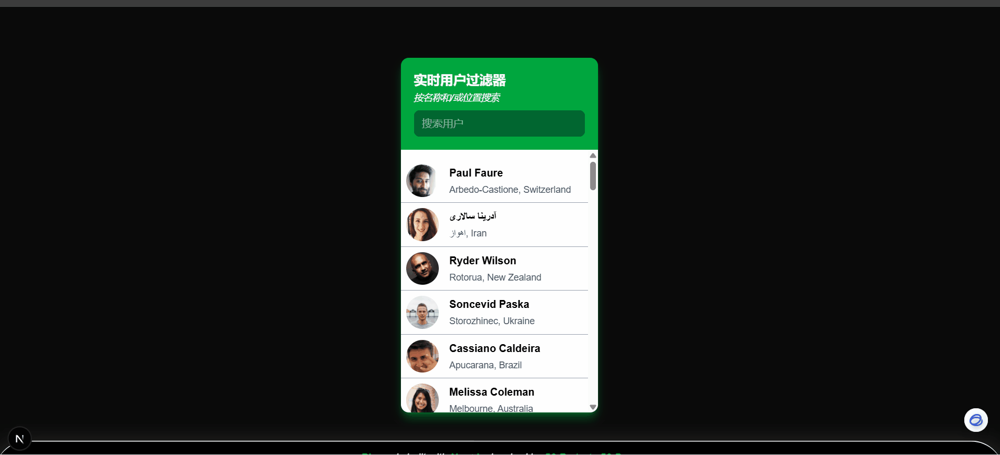
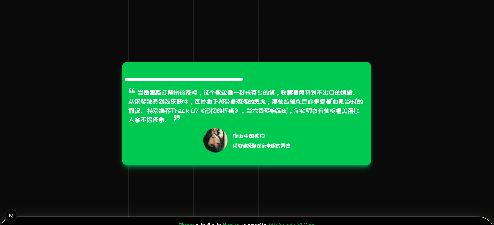

# 初衷

用 NextJS 实现[50days50projects](https://github.com/bradtraversy/50projects50days)中的案例，排解开发后端的郁闷

# Icon

- [iconify](https://iconify.design/docs/icon-components/react/#ssr)

# 相关技术说明

1. 服务端请求数据统一使用next.js内置的fetch 有缓存的功能
2. 客户端请求数据（因为有些api是国外的需要科学上网，我的vscode获取不到api请求，所以只能在浏览器端处理），此时使用react query（缓存）

# case列表

## [01 Github Profiles](<./src/app/(cases)/github-profiles>)

## [02 Clock](<./src/app/(cases)/theme-clock>)

## [03 Auto Text Effect](<./src/app/(cases)/auto-text-effect>)

## [04 Jokes](<./src/app/(cases)/jokes>)

## [05 movie app](<./src/app/(cases)/movie-app>)

## [06 sticky navbar](<./src/app/(cases)/sticky-navbar>)

## [07 kinetic-loader](<./src/app/(cases)/kinetic-loader>)

## [08 live user filter](<./src/app/(cases)/live-user-filter>)

## [09 Double Click Heart](<./src/app/(cases)/double-click-heart>)

## [10 testimonial box switcher](<./src/app/(cases)/testimonial-box-switcher>)

