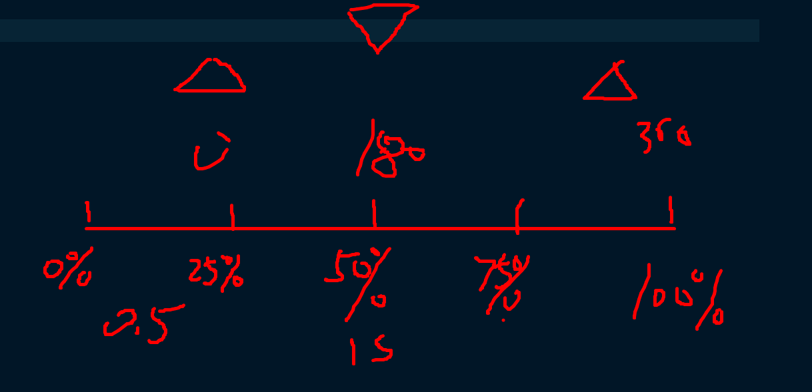

1. 用border来绘制。
2. 怎么控制旋转的顺序? 动画有延迟，结合百分比控制阶段，划分时间范围
   

```scss
$duration: 2s;
$delay: 0.5s;

.TriangleA {
  animation: rotateCircle $duration linear infinite;
}

.TriangleB {
  animation: rotateCircle $duration linear infinite $delay * 1;
}

@keyframes rotateCircle {
  0%,
  25% {
    transform: rotate(0deg);
  }

  50%,
  75% {
    transform: rotate(180deg);
  }

  100% {
    transform: rotate(360deg);
  }
}
```
